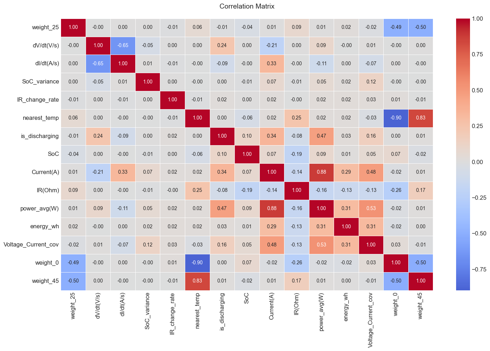
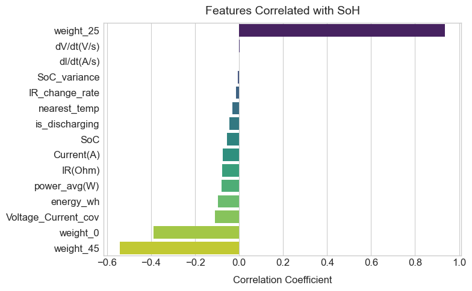
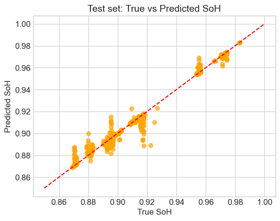
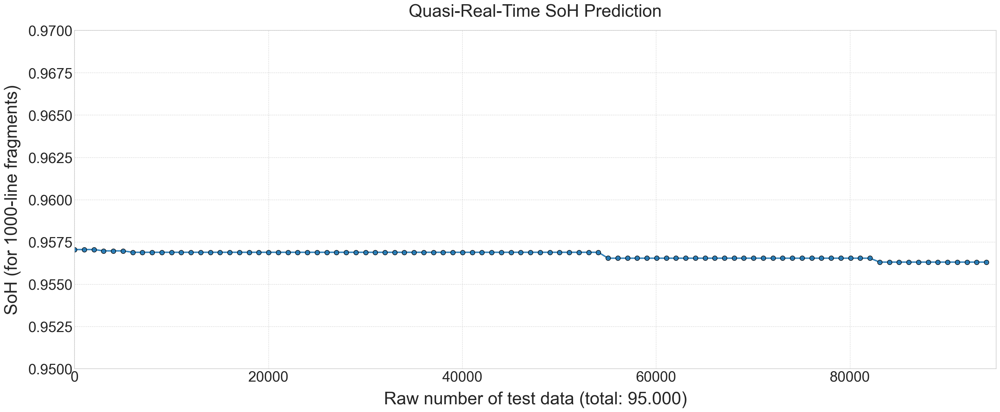

# Battery State of Health (SoH) Estimation Using OCV and Dynamic Tests

## Project Overview
Machine learning solution for predicting lithium-ion battery degradation using:
- **OCV tests** at 0°C/25°C/45°C (Sample1 & Sample2)
- **Dynamic profiles**: DST, FUDS, US06
- Regression models for capacity fade prediction

## Key Features
- Data preprocessing pipeline
- Feature engineering for battery parameters
- SoH prediction models (MAE < 1%)
- Interactive Jupyter visualization

## Tech Stack
```python
Python 3.13.2 | Jupyter | pandas | scikit-learn | matplotlib | seaborn
```

## Repository Structure
```
data/
├── raw/OCV-SOC/         # Raw OCV test files (.xlsx)
├── raw/Dynamic_tests/   # Driving cycle datasets
└── cache/               # Preprocessed data

notebooks/               # Analysis notebooks
src/                     # Python package
models/                  # Trained model binaries
images/                  # Generated plots
```

## Quick Start
```bash
git clone https://github.com/Polczer/Battery_SoH_Estimator.git
cd Battery_SoH_Estimator
pip install -r requirements.txt
jupyter notebook
```

## Output Visualizations
1. **Feature Correlation**  
     
   *Identifies key relationships between battery parameters*

2. **Feature Correlated with SoH**  
   
   *Determining the correlation coefficient for each feature*

3. **SoH Prediction Accuracy**  
     
   *Model performance on test data (MAE < 1%)*

4. **Real-time Simulation**  
     
   *Continuous SoH estimation on dynamic profiles*

## Saving Results
```python
import matplotlib.pyplot as plt
plt.savefig('./images/your_plot.png', dpi=300, bbox_inches='tight')
```

## License
Academic use permitted | Commercial inquiries: valak3j3@gmail.com

## Contact
**Nikolai Matgafurov**  
🔋 Battery Analytics Researcher  
📧 valak3j3@gmail.com  
🏛 ETU "LETI" Saint Petersburg